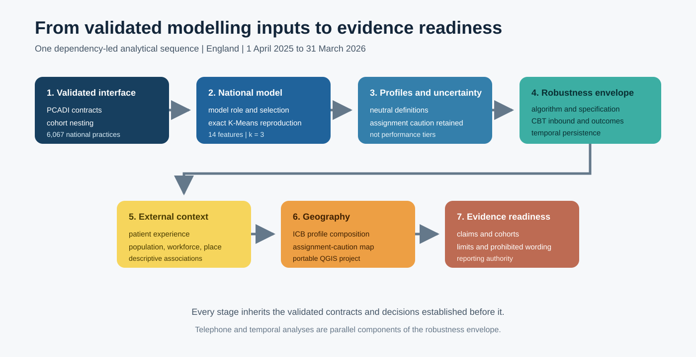
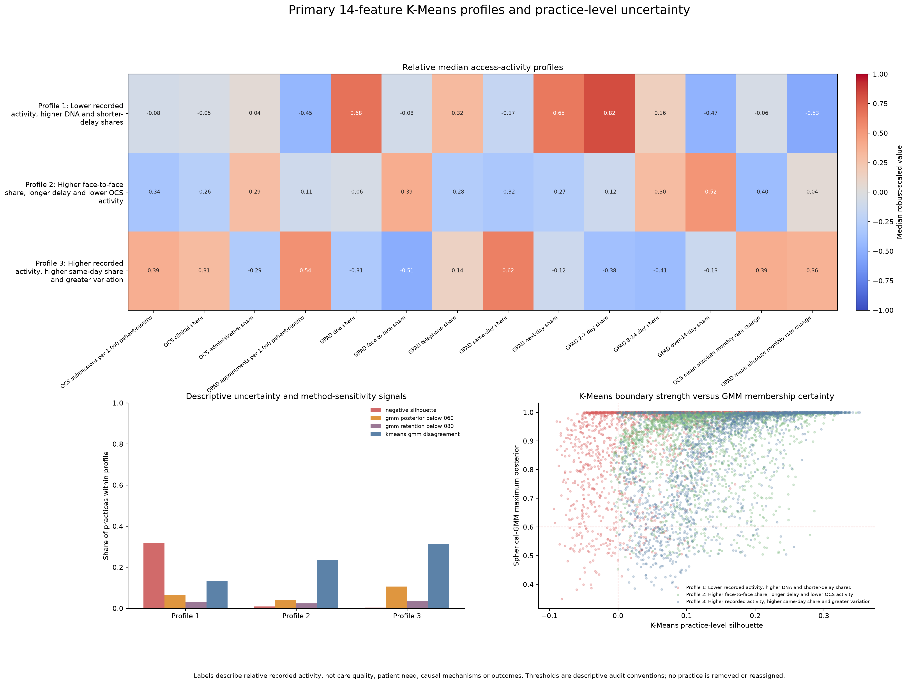

# GPAP²: General Practice Access Patterns and Profiles

**Turning fragmented primary-care data into tested evidence about how access is organised across general practice.**

[](pyproject.toml) [](LICENSE)

GPAP² analyses how online consultation activity, appointment configuration and telephony evidence combine into recurring patterns across general practices in England. It compares modelling approaches, measures assignment uncertainty, tests sensitivity across features and cohorts, examines change over time, and interprets the resulting profiles through patient experience, workforce, deprivation, population and geographic evidence.

Its contribution is not simply the production of practice clusters. It shows which patterns are consistently visible, which practices sit near analytical boundaries, what additional evidence changes the picture, and how public primary-care data can be converted into defensible evidence about access.



## Main result

The national analysis covers **6,067 practices** observed from **1 April 2025 to 31 March 2026**. Fourteen OCS and GPAD features describe practice-size-normalised activity, activity composition and month-to-month variation. The primary model applies the locked transformations and robust scaling before fitting three K-Means profiles.

| Profile | Practices | Neutral description |
|---|---:|---|
| 1 | 1,753 | Lower recorded activity, higher DNA and shorter-delay shares |
| 2 | 2,312 | Higher face-to-face share, longer delay and lower OCS activity |
| 3 | 2,002 | Higher recorded activity, higher same-day share and greater variation |



The public implementation exactly reproduces all 6,067 frozen assignments using seed 2026, 100 initialisations, a maximum of 500 iterations and the Lloyd algorithm. Telephone evidence is analysed in nested reporting cohorts: 3,020 practices for inbound-call evidence and 1,456 practices for outcome-complete evidence. For the outcome-complete cohort, the preferred sensitivity uses the authoritative NHS-aligned 20-feature ILR representation. It reassigns 52 practices relative to the 17-feature baseline, compared with 729 under the raw 21-feature representation.

These profiles describe configurations of recorded practice activity. They are not performance tiers and do not measure total demand, unmet need, workload, resolution, safety or causal impact.

## Follow the analytical sequence

GPAP² uses purpose-led notebooks in one dependency-led analytical sequence. Each stage inherits
the validated contracts and evidence established before it. Telephone and temporal analyses are
parallel sensitivity components within the same robustness stage; neither is described as a
computational prerequisite for the other.

| Stage | Analytical purpose | Evidence handed forward |
|---:|---|---|
| 1 | Establish the validated modelling interface | [Input and cohort contracts](notebooks/01_validate_the_access_profile_inputs.ipynb) |
| 2 | Justify and reproduce the national profile model | [Model-role evidence and exact national assignments](notebooks/02_select_national_access_pressure_profiles.ipynb) |
| 3 | Define national profiles and assignment uncertainty | [Profile interpretation and uncertainty contract](docs/profile-interpretation.md) |
| 4 | Test the robustness envelope | [Algorithm and specification evidence](outputs/tables/robustness_summary.csv), [CBT inbound](notebooks/03_test_telephone_inbound_evidence.ipynb), [CBT outcomes](notebooks/04_test_telephone_outcome_composition.ipynb) and [temporal persistence](notebooks/05_assess_temporal_persistence.ipynb) |
| 5 | Interpret profiles through external context | [Population, workforce, patient-experience, deprivation and rurality evidence](notebooks/06_interpret_profiles_with_external_context.ipynb) |
| 6 | Examine geography and system distribution | [Portable QGIS project and geographic interpretation](docs/geography-and-qgis.md) |
| 7 | Translate the combined evidence into evidence readiness | [Claim-to-evidence authority](notebooks/07_translate_profiles_into_evidence_readiness.ipynb) |

## Public execution scope

| Evidence layer | Public execution class |
|---|---|
| Input contracts and cohort nesting | Recomputed and validated |
| National clustering and assignments | Recomputed |
| CBT inbound comparison | Recomputed |
| Raw outcome and NHS-ILR comparison | Recomputed |
| Temporal robustness | Validated from frozen authority tables |
| External context | Validated from frozen authority tables |
| Evidence readiness | Inspected from checksum-controlled writing authority |
| QGIS maps | Portable project plus structural and runtime evidence |

## Reproduce the reference route

The three matrices are produced by the immutable PCADI tag [`reference-apr2025-mar2026`](https://github.com/PeterHDS/pcadi-data-integration/releases/tag/reference-apr2025-mar2026) at commit `1239c63356acfb824277ee6fbaee25fa8df51313`. The acquisition script downloads each file to a temporary location, verifies its filename, byte size, schema and SHA-256, then installs it atomically.

Windows PowerShell:

```powershell
py -m venv .venv
.\.venv\Scripts\Activate.ps1
python -m pip install -e ".[dev,notebooks,docs]"
python scripts/fetch_pcadi_inputs.py
python -m gpap2 validate
python scripts/reproduce_primary_profiles.py
python scripts/build_analytical_regression_evidence.py --check
pytest
python scripts/execute_public_notebooks.py --check
python scripts/validate_public_repository.py
python qgis/scripts/validate_qgis_project.py
```

Linux or macOS:

```bash
python3 -m venv .venv
source .venv/bin/activate
python -m pip install -e '.[dev,notebooks,docs]'
python scripts/fetch_pcadi_inputs.py
python -m gpap2 validate
python scripts/reproduce_primary_profiles.py
python scripts/build_analytical_regression_evidence.py --check
pytest
python scripts/execute_public_notebooks.py --check
python scripts/validate_public_repository.py
python qgis/scripts/validate_qgis_project.py
```

The reference run used Windows 11, Python 3.13.14 and QGIS 3.44.12 LTR. The workflow in [`.github/workflows/ci.yml`](.github/workflows/ci.yml) defines Python 3.11, 3.12 and 3.13 gates with read-only permissions and actions pinned to full commit SHAs.

## Read the evidence

- [Analytical roadmap](docs/analytical-roadmap.md)
- [Profile interpretation](docs/profile-interpretation.md)
- [Telephone evidence](docs/telephone-evidence.md)
- [Temporal robustness](docs/temporal-robustness.md)
- [External context](docs/external-context.md)
- [Geography and QGIS](docs/geography-and-qgis.md)
- [Evidence readiness](docs/evidence-readiness.md)
- [Data and lineage](docs/data-and-lineage.md)
- [Reproducibility contract](docs/reproducibility.md)

## Repository boundary

[PCADI](https://github.com/PeterHDS/pcadi-data-integration) owns NHS source acquisition guidance, SQL integration, practice-month validation and annual matrix construction. GPAP² starts at the validated modelling interface and owns preprocessing, clustering, robustness, contextual linkage, mapping and evidence-ready interpretation. The upstream integration pipeline is referenced rather than duplicated.

## Repository map

| Path | Purpose |
|---|---|
| [`notebooks/`](notebooks/README.md) | Seven purpose-led notebooks in one dependency-led analytical sequence |
| [`src/gpap2/`](src/gpap2) | Typed configuration, contracts, preprocessing, modelling and validation |
| [`configs/`](configs/reference_apr2025_mar2026.json) | Complete reference-period analytical contract |
| [`data/contracts/`](data/contracts/pcadi_input_contracts.csv) | Immutable PCADI file, schema and provenance contracts |
| [`outputs/`](outputs/README.md) | Selected tables, figures and machine-readable validation evidence |
| [`qgis/`](qgis/README.md) | Portable QGIS project, data, previews and structural validation |
| [`tests/`](tests) | Unit, schema and analytical regression tests |

## Citation and reuse

Use [`CITATION.cff`](CITATION.cff) for citation metadata. Code is licensed under the [MIT License](LICENSE). Documentation is available under [CC BY 4.0](DOCUMENTATION_LICENSE.md). NHS-derived data and geographic assets retain their source terms; review [data licensing](DATA_LICENSE.md) before redistribution.

GPAP² was developed and is maintained by Peter Oluwatimilehin as an open research and reproducibility resource.
