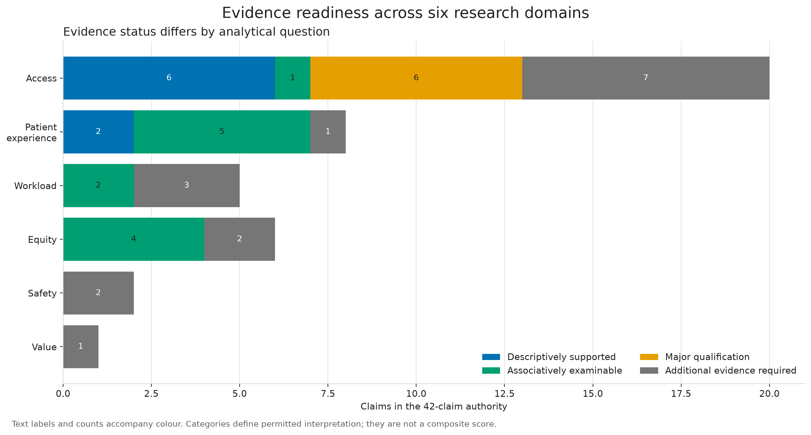

# Evidence readiness

Evidence readiness connects each proposed interpretation to the construct observed, the population represented and the exact evidence that can support it.

The canonical authority contains **42 claims across six domains**:

| Domain | Claims |
|---|---:|
| Access | 20 |
| Patient experience | 8 |
| Workload | 5 |
| Equity | 6 |
| Safety | 2 |
| Value | 1 |

Each claim has one of four evidence states: descriptively supported, associatively examinable, supportable only with major qualification, or not supportable with current public data. These categories are interpretation controls, not a composite score.

## Use the evidence objects

- [Explore the designed Evidence Map](evidence-map/index.html) to search and filter all 42 claims.
- [Read the text fallback](evidence-map.md) without JavaScript.
- [Download the canonical claim-to-evidence matrix](../outputs/tables/claim_to_evidence_matrix.csv) for the complete scientific contract.
- [Download the presentation layer](../outputs/tables/evidence_map_presentation.csv) for repository links and population-scope notes.
- [Download the population scope register](../outputs/tables/population_scope_register.csv) for the empirical cohort boundaries.

The presentation layer does not change any scientific classification. It links each claim to the appropriate national, CBT inbound or CBT outcome population and to evidence already included in the repository.

## Interpretation boundary

The current evidence can describe recurring recorded-activity configurations, assignment uncertainty, specification sensitivity, selected practice-level associations and geographic composition. Claims about resolved patient need, access pathways, workload reduction, safety, clinical quality, patient-level equity, supplier effects, economic value or causal impact require additional linked pathway, outcome, implementation or cost evidence.
