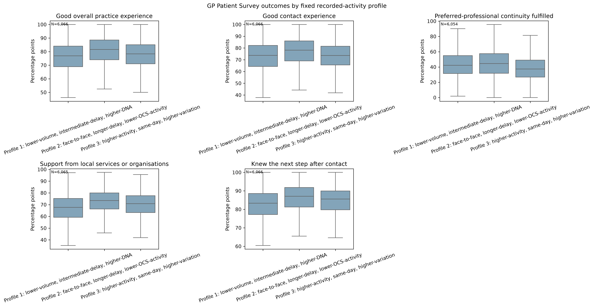

# External context

Frozen profile assignments were linked to independent public evidence after clustering. This preserves the distinction between variables that define the profiles and variables used to interpret them.

## Evidence layers

- GP Patient Survey measures provide practice-level patient-experience context with measure-specific valid denominators.
- Workforce measures describe staffing context rather than individual workload.
- Registered population and age measures describe practice population structure.
- Deprivation and rurality provide place-based context.
- March 2026 organisational mappings support ICB and region summaries.

The primary contextual multinomial model uses 5,774 complete practices. Average marginal effects and sensitivity checks are presented as practice-level associations. They do not establish patient-level mechanisms or causal effects.

Selected authority tables and figures are retained under [`outputs/`](../outputs/README.md). The claim-to-evidence register records the cohort and interpretation boundary for every result used in writing.
