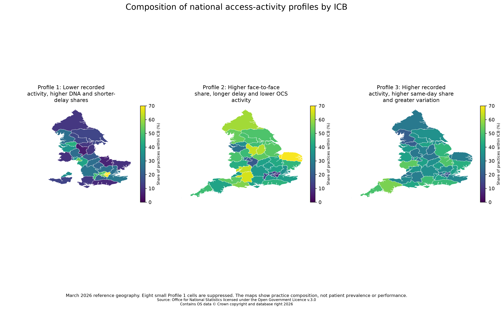

# Geography and QGIS

The portable QGIS package maps profile composition across 42 March 2026 ICB organisations using April 2023 ICB boundaries. The analytical values cover 1 April 2025 to 31 March 2026.

## Open the project

1. Install QGIS 3.44 LTR or a compatible later version.
2. Open [`qgis/GPAP2_Digital_GP_Access_Profiles_March_2026.qgz`](../qgis/GPAP2_Digital_GP_Access_Profiles_March_2026.qgz).
3. Keep the project file and `data/` directory together so relative paths resolve.
4. Open one of the two print layouts: `National three-profile composition` or `Assignment-caution share`.

Four styled layers show each profile's within-ICB share and the share of practices marked for assignment caution. Eight Profile 1 cells with counts below five are suppressed and their percentages are withheld.

Source: Office for National Statistics licensed under the Open Government Licence v.3.0

Contains OS data © Crown copyright and database right 2026

The maps represent practice composition, not patient prevalence or ICB performance. No spatial statistic, rank or post-April-2026 boundary conversion is applied.

The portable data deliberately separates three concepts:

- `analysis_period`: 1 April 2025 to 31 March 2026;
- `boundary_vintage`: April 2023;
- `organisation_reference_date`: 31 March 2026.

The March 2026 ODS ICB organisations were linked to the April 2023 ONS boundaries through the audited normalised-name crosswalk. This is a practice-location context layer, not a patient-residence geography.
