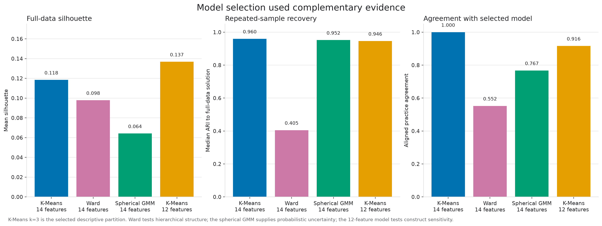

# Model selection and uncertainty

GPAP² selected K-Means after comparing cluster counts, feature specifications and alternative algorithms. The result is a chosen descriptive resolution, not proof that three groups are the only possible structure.

## Why three profiles

The national comparison considered k=2, k=3 and k=4. The three-profile solution retained a stable, interpretable middle resolution without the small fourth group produced by k=4. Across 100 common-sample runs, the selected model had:

- median ARI to the full-data solution: 0.9599;
- fifth-percentile ARI: 0.9165;
- minimum ARI: 0.8666;
- median pairwise ARI: 0.9409;
- minimum cluster retention: 0.9295.

These results support reproducibility of the selected partition under repeated sampling. They do not remove practice-level boundary uncertainty.

## Methods considered

| Method | Role | Final position |
|---|---|---|
| K-Means, 14 features, k=3 | National hard partition | Selected descriptive benchmark |
| Ward agglomerative clustering | Hierarchical structural diagnostic | Retained as method-comparison evidence |
| Spherical Gaussian mixture model | Probabilistic membership companion | Retained for posterior uncertainty and algorithm sensitivity |
| K-Means, 12 features, k=3 | Construct-validity comparator | Retained as feature sensitivity |

K-Means was selected after comparison, not because it was the only method tried. Ward produced a less reproducible partition and a small branch associated with reporting provenance. The spherical GMM was reproducible but had lower hard-partition separation; its strongest contribution is probabilistic uncertainty. The 12-feature comparator remained substantially aligned with the selected model (ARI 0.7609, 91.64% agreement, 507 changed practices).

## Practice-level uncertainty

Every practice retains its national profile assignment for reproducibility. Uncertainty evidence remains attached through:

- K-Means silhouette values;
- GMM maximum posterior probabilities;
- GMM resampling retention;
- K-Means versus GMM disagreement;
- an interpretive-caution flag used in contextual and geographic sensitivity work.

The hard partition is therefore available for descriptive comparison without implying that every assignment is equally strong. See the [analytical model card](analytical-model-card.md), [national assignments](../outputs/tables/national_profile_assignments.csv), [uncertainty summary](../outputs/tables/national_uncertainty_summary.csv) and [model-selection authority](../outputs/tables/national_model_selection_summary.csv).
