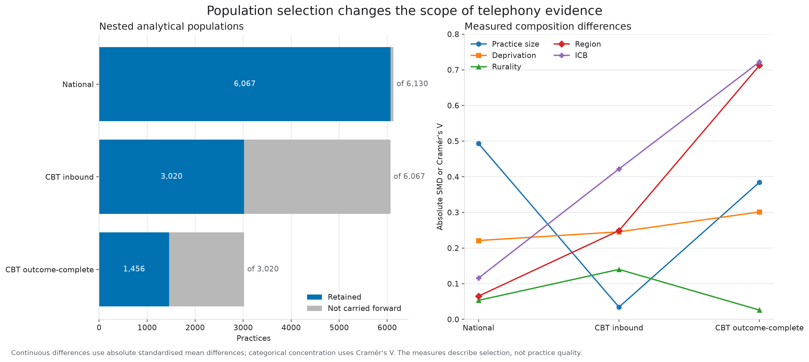
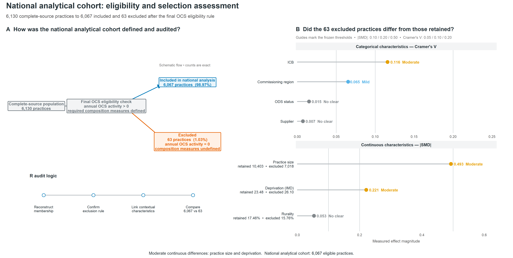
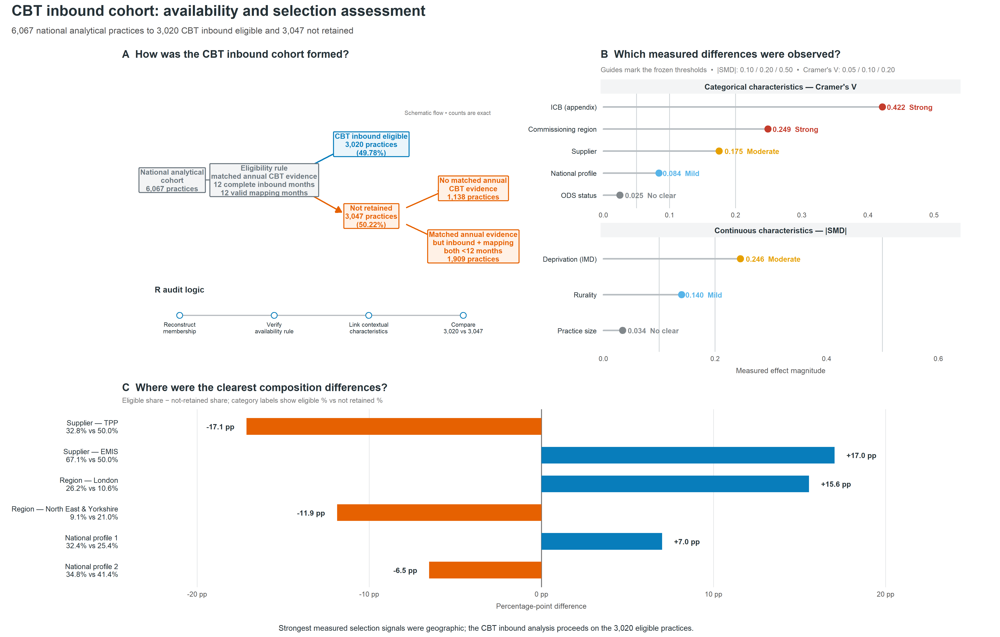
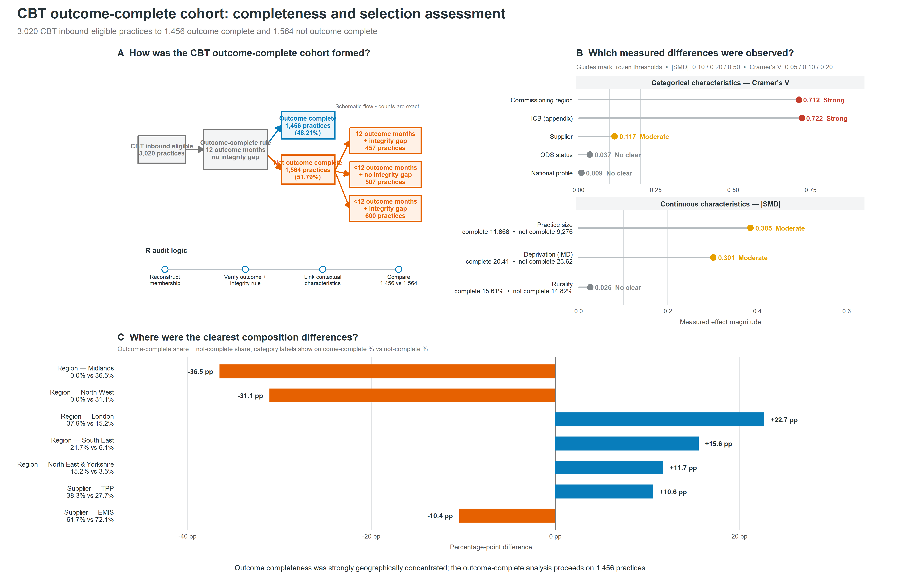

# Population and generalisability

The cohort-selection audit tests who the national and telephone analyses directly represent. When some practices cannot enter an analysis, generalisability depends on both the number not carried forward and whether the retained practices have a similar measured composition to their parent population.

## Three analytical boundaries

| Analysis | Parent population | Retained | Not carried forward |
|---|---:|---:|---:|
| National activity profiles | 6,130 | 6,067 | 63 |
| CBT inbound sensitivity | 6,067 | 3,020 | 3,047 |
| CBT outcome-complete sensitivity | 3,020 | 1,456 | 1,564 |

The audit compares practice size, deprivation, rurality, supplier, region, ICB and ODS status. The two CBT stages also compare the frozen national profile. Standardised mean differences (SMDs) describe continuous-variable balance; Cramér's V describes categorical concentration. These measures describe population selection, not practice quality.

## National analytical population

The complete-source parent contains 6,130 practices. The national model retains 6,067. The other 63 have zero annual OCS activity, so required OCS composition measures are undefined and no national profile is assigned.

Practice size shows the largest measured difference (SMD 0.4931). Deprivation has SMD -0.2212, while rurality, region and ICB show smaller differences. The national findings therefore describe the 6,067 retained practices directly.

## CBT inbound population

The inbound sensitivity retains 3,020 of the 6,067 nationally profiled practices. Among the 3,047 not carried forward, 1,138 have no matched annual CBT evidence and 1,909 have matched evidence but fewer than 12 complete inbound and valid mapping months.

Practice size is similar between the retained and non-retained groups (SMD 0.0345). Geographic concentration is stronger: region Cramér's V is 0.2490 and ICB Cramér's V is 0.4220. Frozen national profile concentration is mild (Cramér's V 0.0840). Inbound findings apply directly to the 3,020-practice reporting cohort rather than all nationally profiled practices.

## CBT outcome-complete population

The outcome-composition analysis retains 1,456 of the 3,020 inbound-eligible practices. The other 1,564 comprise 457 practices with 12 outcome months plus an integrity gap, 507 with fewer than 12 outcome months and no integrity gap, and 600 with both fewer than 12 months and an integrity gap.

Geographic concentration is very strong: region Cramér's V is 0.7124 and ICB Cramér's V is 0.7221. Frozen national profile concentration is negligible (Cramér's V 0.00925). The strongest telephony evidence is therefore geographically selective, while outcome-complete selection is not strongly concentrated by frozen national profile. The audit does not establish why the geographic concentration occurred.

## How to use this evidence

The claim boundary is empirical rather than assumed:

- national profile findings directly describe 6,067 retained practices;
- inbound-call findings directly describe 3,020 practices meeting the inbound evidence contract;
- outcome-composition findings directly describe 1,456 practices meeting the outcome-completeness contract;
- practices not carried into a later CBT cohort retain their national profile;
- missing or integrity-affected telephony evidence remains missing.

The [population-scope register](../outputs/tables/population_scope_register.csv) provides the machine-readable summary. The exact flow, continuous-balance and categorical-concentration tables are retained under [`outputs/tables/`](../outputs/tables/). The complete native-R reproduction is registered in [reproducibility releases](reproducibility-releases.md).
