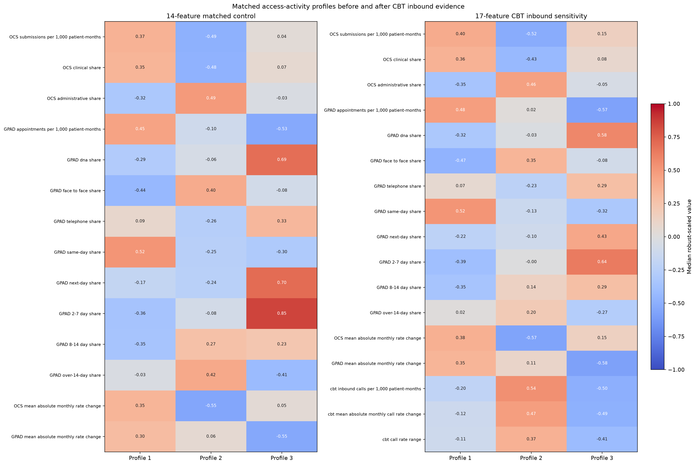
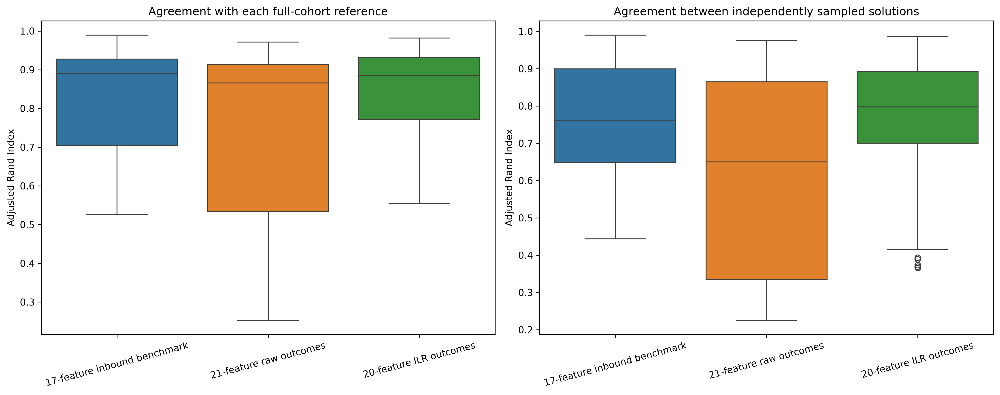

# Telephone evidence

CBT evidence is analysed within nested practice cohorts because complete telephone reporting is not nationally available for every practice.

## Inbound-call sensitivity

The 3,020-practice cohort adds inbound calls per 1,000 registered patient-months, mean absolute monthly call-rate change and annual call-rate range to the fourteen national features. The matched full-data comparison retains 2,449 assignments and reassigns 571. The adjusted Rand index between specifications is 0.5236.

Closed resampling evidence remains checksum-controlled. It supports within-specification stability while leaving cohort availability as an interpretation boundary.

## Outcome-complete sensitivity

The 1,456-practice cohort contains four strictly positive recorded outcome shares in this order: answered, missed, IVR exit and callback request. The shares approximately sum to one, so entering all four as independent robust-scaled Euclidean variables repeats influence from one constrained family.

The preferred sensitivity closes each row to one and calculates three named NHS-aligned balances:

1. dealt versus missed;
2. answered versus IVR and callback;
3. IVR versus callback.

The calculation uses the locked orthonormal basis, passes inverse reconstruction and adds no pseudocount. The 20-feature model reassigns 52 practices relative to the 17-feature baseline. Agreement is ARI 0.894915 and NMI 0.838160, with 96.43% aligned agreement.

The raw 21-feature representation reassigns 729 practices and has ARI 0.248685 against the same baseline. It remains a representation comparator, not a second primary result.

