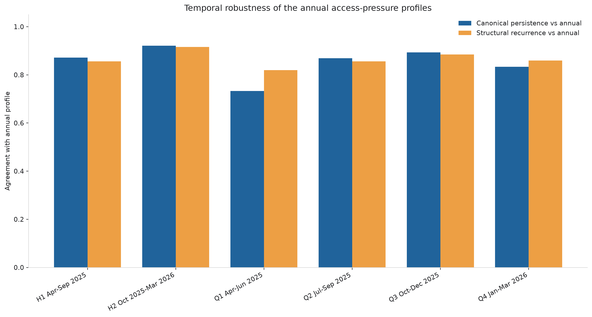

# Temporal robustness

The national profiles summarise twelve complete months from April 2025 to March 2026. Temporal tests ask whether similar structures recur when the period is shortened.

## Half-year comparison

The common half-year cohort contains 5,924 practices. The **direct canonical H1-to-H2 comparison** agrees for 80.32% of practices, with adjusted Rand index 0.4964. This measures agreement between the two fitted half-year partitions after label alignment.

The **repeated common-sample H1-to-H2 comparison** is a different robustness result: its median adjusted Rand index is 0.4638. Seeded recovery against each window's full-data solution is high, with median adjusted Rand index 0.9602 for April to September and 0.9680 for October to March.

## Quarterly comparison

The common quarterly cohort contains 5,677 practices. All-quarter assignment persistence is 54.92% under canonical alignment and 63.91% under structural alignment. The April-to-June window is the clearest diagnostic exception and is sensitive to the treatment of variation features.

## Decision

Shorter windows contain useful movement information but add assignment variability and reduce calculable cohort size. The twelve-month model remains the national descriptive anchor. Temporal results are robustness evidence, not replacement profile labels.

The [direct comparison](../outputs/tables/temporal_half_year_direct_comparison.csv) and [repeated-sample summary](../outputs/tables/temporal_half_year_resampling_summary.csv) are retained separately so the two ARI estimates cannot be conflated.
